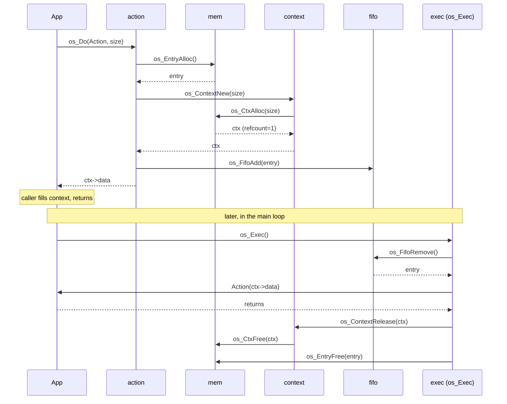
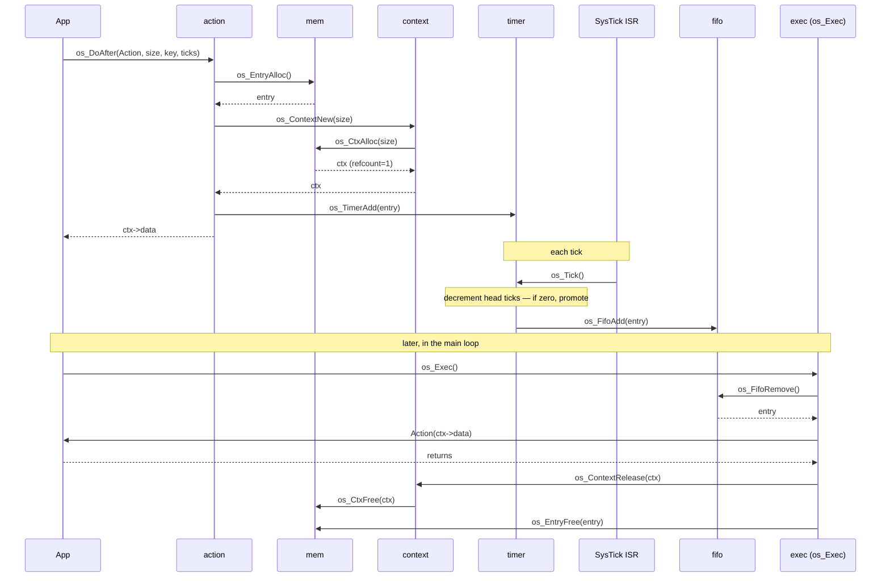
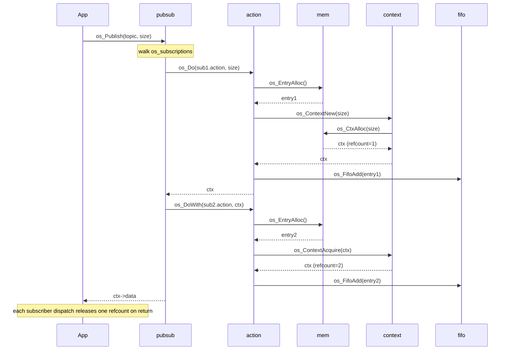
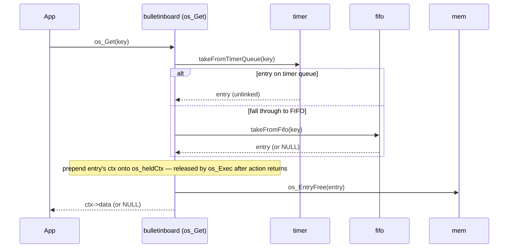
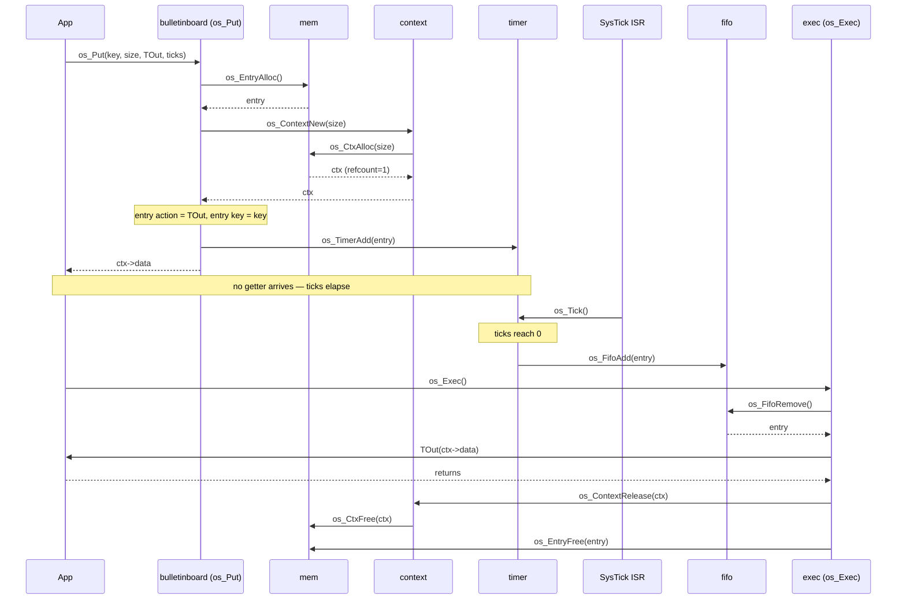
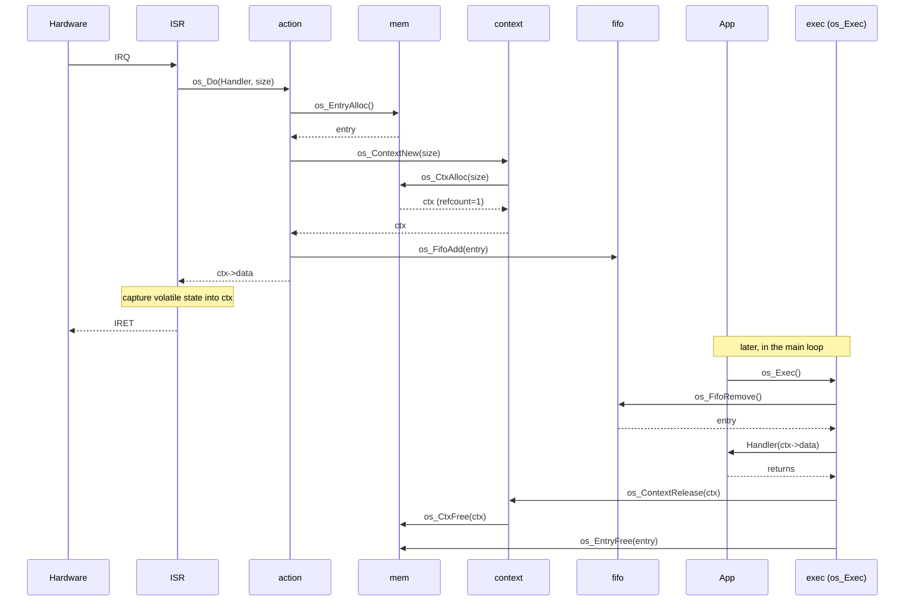

# EventOS — Design Notes

This document records the *mechanism* behind EventOS: internal structure,
architectural decisions, and the rationale behind non-obvious
implementation choices. It is a companion to [EventOS.md](EventOS.md),
which defines the *contract* — what the OS promises its users.

- **Contract changes** → update `EventOS.md`.
- **Mechanism changes** → update `design.md`.

Readers: this is for maintainers and port authors. Application developers
working against the public API should not need to read this. If you find
yourself reading this to figure out how to use EventOS, `EventOS.md` is
the missing link.

---

## 1. Architectural decisions

Running log of decisions that shape the implementation. Each entry names
the decision, the context that motivated it, the alternatives considered,
and the rationale for the choice. Entries are append-only: superseding an
older decision means adding a new entry that cites the prior one, not
rewriting history.

### ADR-001: Bulletin board is a usage shape of cancellable dispatch

**Date:** 2026-04-18

**Status:** Landed.

**Context.** `os_bbEntry_t` is structurally a subset of `os_entry_t` (drop
`ticks`, rename `action`→`timeoutAction`). Every live bulletin-board slot
currently costs an entry on a private list *plus* a separately-scheduled
timer-queue entry for the TTL timeout — two records and two contexts per
slot.

**Decision.** Bulletin-board entries live directly on the timer queue,
using `os_entry_t`. TTL firing is normal timer-queue → FIFO promotion.
`os_Get` is "cancel-by-key that hands you the cancelled entry's context."
The public API (`os_Put`, `os_PutWith`, `os_Get`) stays; it frames the
mailbox use case even though the mechanism is cancellable dispatch, same
way `os_Do`/`os_DoAfter` share one mechanism under two names.

**Alternatives.** Keep the bulletin board as a separate subsystem and fix
only the set-semantics bug — rejected because the duplication was already
paying a maintenance cost in parallel data structures.

**Consequences.**

- Deleted: `os_bbEntry_t`, `os_blackboard`, `bbAlloc`/`bbFree`,
  `os_BbTimeout` (as a routing hop), the key-holder context,
  `OS_MAX_BB_ENTRIES`, `OS_FAIL_BB_FREE`.
- Entry pool now serves three roles (FIFO, timer queue, bulletin board);
  sizing revisit on deck.
- Public contract in `EventOS.md` §1.6 is unchanged.
- Depends on the dispatch set-semantics fix landing first (ADR-002).

### ADR-002: Set semantics for cancellable dispatch

**Date:** 2026-04-18

**Status:** Landed.

**Context.** `os_DoAfter` / `os_DoAfterWith` prepend to the timer queue
without checking for an existing entry with the same key. `EventOS.md`
§1.3 commits to set semantics — at most one pending action per key,
across timer queue and FIFO combined, with re-use replacing the
existing entry.

**Decision.** Before adding a new entry, both calls remove any
existing pending entry with the matching key via a cross-list walk
(timer queue + FIFO). `OS_NO_KEY` entries are not in the set and
bypass the check. Replaced entries go through the normal cancellation
release path.

**Alternatives.** Per-key hash index — rejected; queue depths are
small, linear walk is adequate. Keep current behavior — rejected;
contract has shifted.

**Consequences.**

- Adds an O(n) search step to both calls where n is combined
  timer-queue + FIFO depth.
- Eliminates duplicate-key scheduling as a silent failure mode.
- Depends on ADR-003 and ADR-004 to behave correctly in all code
  paths.

### ADR-003: Preserve cancel key on ticks-zero dispatch

**Date:** 2026-04-18

**Status:** Landed.

**Context.** `os_DoAfter(action, size, key, 0)` delegates to
`os_Do(action, size)`, and `os_Do` hardcodes `key = OS_NO_KEY`. The
caller's key is silently dropped, leaving the resulting FIFO entry
uncancellable. Same pattern in `os_DoAfterWith`.

**Decision.** The ticks-zero path preserves the caller's key. Either
inline a keyed FIFO-post or introduce a shared private helper that
both `os_Do` and the ticks-zero path use.

**Alternatives.** Patch the key on the returned entry after `os_Do`
returns — race-prone and ugly. Reject `ticks == 0` — contradicts
`EventOS.md` §1.3.

**Consequences.**

- Minor refactor of `os_DoAfter` and `os_DoAfterWith`.
- Ticks-zero entries now participate in the key set per `EventOS.md`
  §1.3.
- Unblocks ADR-002 across all scheduling paths.

### ADR-004: Cancellation releases, not frees, the cancelled entry's context

**Date:** 2026-04-18

**Status:** Landed.

**Context.** `fifoCancel.c` and `timerRemove.c` free the cancelled
entry's context via `os_CtxFree`, bypassing the refcount. Unsafe when
the context has multiple holders — the case that arises under pub/sub
fan-out when one subscriber's delivery is cancelled while others
remain in flight.

**Decision.** Both cancellation paths call `os_ContextRelease` on the
cancelled entry's context. The refcount decrement may or may not
trigger `os_CtxFree`, depending on whether other holders remain.

**Alternatives.** Keep `os_CtxFree` — rejected; incorrect under
multi-holder contexts. Check refcount in the caller — rejected;
duplicates the logic `os_ContextRelease` already provides.

**Consequences.**

- Correct cancellation semantics under pub/sub fan-out.
- Must land before ADR-002; set-semantics replacement exercises this
  path more aggressively.

### ADR-005: Subscriptions are one-node-per-action

**Date:** 2026-04-18

**Status:** Landed.

**Context.** `os_subscription_t` is currently
`{ next, topic, actions[OS_NUMBER_OF_SUBS] }` — one node per topic
with subscribers packed into an inline array, compacted on
unsubscribe by slide-up. This imposes a per-topic subscriber cap,
wastes memory when arrays are partially full, and introduces the
`OS_NUMBER_OF_SUBS` configuration knob.

**Decision.** Flatten to `{ next, topic, action }` — one node per
(topic, action) pair. Publish walks the list and fires every node
whose topic matches. Sizing is `OS_MAX_SUBSCRIPTIONS` = total
subscribers across all topics; no per-topic cap. Unsubscribe
unlinks one node; no compaction.

**Alternatives.** Per-topic hash index — rejected; topic counts
are typically small, a walk is adequate until measured otherwise.
Keep the array — rejected; ongoing memory waste and record-shape
asymmetry with the rest of the OS (everywhere else is one-node-
per-item).

**Consequences.**

- Record shrinks from ~24 bytes to ~12.
- `OS_NUMBER_OF_SUBS` knob retired; only `OS_MAX_SUBSCRIPTIONS`
  remains.
- Publish is O(total_subs) per call; topic-search performance
  becomes a watch item. Address if topic counts grow large in
  practice.
- `OS_FAIL_SUBSCRIBE_FULL` no longer has a per-topic meaning.
  Decide at implementation whether to retire it or keep as a
  synonym for `OS_FAIL_SUBSCRIBE_ALLOCATION`.
- Public contract in `EventOS.md` §1.5 needs the "Per-topic
  subscriber limit" bullet updated when this lands.

### ADR-006: Delete `os_GetCtx`

**Date:** 2026-04-18

**Status:** Landed.

**Context.** `os_GetCtx` is declared in `os_p.h`, defined in
`getCtx.c`, and tested in `test_getCtx.c`. It is not called from any
other source file. It performs the same pointer math
(`context - offsetof(os_ctx_t, data)`) that `os_ContextAcquire` does
inline.

**Decision.** Delete `os_GetCtx` declaration, definition, and test.

**Alternatives.** Keep as a public utility for future use —
rejected; "we might need it" does not earn code's place in the tree.

**Consequences.** Three-file deletion; no callers, no ripples.

### ADR-007: `os_ctx_t` gains a `next` pointer; free-list and held-list share it

**Date:** 2026-04-18

**Status:** Landed.

**Context.** `os_ctx_t` currently has no linkage field in its
header. The pool allocator threads the free-list through the first
bytes of each free slot using a `memcpy`-based trick
(`slotSetNext` / `slotGetNext`), because free slots have undefined
layout. When we lift the held-context single-slot rule (ADR-008), we
need a list linkage for per-action held contexts — and no current
mechanism supports it.

**Decision.** Add a `next` pointer to the `os_ctx_t` header:

```c
typedef struct os_ctx_s {
    struct os_ctx_s *next;  // free-list while free; held-list while held
    uint8_t count;
    uint16_t size;
    uint32_t data[];
} os_ctx_t;
```

The field is unused while a context is "alive" (held by one or more
entries via refcount). It is used while free (linked into the
allocator's free-list) and while held (linked into the current
action's held-list per ADR-008).

**Alternatives.** Keep the memcpy free-list trick; use a separate
pool for held-list nodes — rejected; a second pool for one-field
nodes is wasteful. Fixed-size stack array in `os_Exec` for the
held-list — rejected; imposes an arbitrary cap.

**Consequences.**

- `os_ctx_t` header grows by 4 bytes (one pointer on 32-bit).
- `ctxAllocPool` free-list shifts from the `memcpy` trick to direct
  pointer access — simpler, same footprint.
- `ctxAllocMalloc` unaffected (no free-list).
- Prerequisite for ADR-008.

### ADR-008: Held-context lift — per-action held-list

**Date:** 2026-04-18

**Status:** Landed.

**Context.** `os_heldCtx` is a single global pointer holding the
context returned by `os_Get`. `os_Exec` releases it after the action
runs. This imposes the one-held-context-per-action limit the
`EventOS.md` §1.6 contract no longer claims.

**Decision.** Replace `os_heldCtx` with a per-action held-list
threaded through `os_ctx_t.next` (ADR-007). Before calling the
action, `os_Exec` sets the held-list head to NULL. `os_Get` prepends
the retrieved context onto the head. After the action returns,
`os_Exec` walks the list and releases each context.

**Alternatives.** Fixed-size stack array in `os_Exec` — imposes a
cap. Dedicated pool of held-list nodes — wasteful extra pool. Both
subsumed by ADR-007.

**Consequences.**

- Unbounded held contexts per action (bounded only by total
  context-pool capacity).
- `os_Exec` gains a held-list walk on action return; O(H) where H
  is this action's held count.
- Public contract in `EventOS.md` §1.6 now matches implementation.
- Depends on ADR-007 landing first.

---

## 2. Internal API map

EventOS is built from a small set of cooperating modules, each using
single-function `.c` files with declarations split between `os.h`
(public) and `os_p.h` (private). Calls flow from upper layers to lower
layers; the port boundary is the only contract crossing the OS/platform
seam.

**Module stack (top = user-facing, bottom = platform):**

```
Layer 1 (public entry points):     action, pubsub, bulletinboard
Layer 2 (queues + refcount):       fifo, timer, context
Layer 3 (allocators):              mem
Layer 4 (platform):                port  (HAL + weak stubs)
```

Same-layer modules do not call each other. The one deliberate exception
is `os_Get` in `bulletinboard/`, which walks the FIFO and timer-queue lists
directly via static helpers to transfer entry ownership atomically
(ADR-001).

### Module map

| Module | Source | Public API (`os.h`) | Private API (`os_p.h`) | Calls into |
|---|---|---|---|---|
| **action** | `action/` | `os_Do`, `os_DoWith`, `os_DoAfter`, `os_DoAfterWith`, `os_CancelPending` | — | mem, context, fifo, timer |
| **bulletinboard** | `bulletinboard/` | `os_Put`, `os_PutWith`, `os_Get` | — | mem, context, action (cancel), fifo/timer (direct list walks in `os_Get`) |
| **pubsub** | `pubsub/` | `os_Subscribe`, `os_Unsubscribe`, `os_UnsubscribeAll`, `os_Publish`, `os_PublishWith`, `os_SubInUse`, `os_SubHighWater`, `os_SubHighWaterReset` | `os_SubAlloc`, `os_SubAllocInit`, `os_SubFree` | action (`os_Do` / `os_DoWith` fan-out) |
| **fifo** | `fifo/` | `os_Exec` | `os_FifoAdd`, `os_FifoRemove`, `os_FifoCancel` | mem, context, weak hooks |
| **timer** | `timer/` | `os_Tick` | `os_TimerAdd`, `os_TimerRemove`, `os_TimerInit` | fifo (expired promotion), mem, context |
| **context** | `context/` | — | `os_ContextNew`, `os_ContextAcquire`, `os_ContextRelease` | mem (`os_CtxAlloc` / `os_CtxFree`), `os_Fail` |
| **mem** | `mem/` | `os_EntryInUse`, `os_EntryHighWater`, `os_EntryHighWaterReset`, `os_CtxInUse`, `os_CtxHighWater`, `os_CtxHighWaterReset` | `os_EntryAlloc`, `os_EntryAllocInit`, `os_EntryFree`, `os_CtxAlloc`, `os_CtxAllocInit`, `os_CtxFree` | port (`hal_Critical*`) |
| **os** | `os.c` | `os_Init`, `os_NullAction` | (owns shared globals) | every module's `*Init` function |
| **port** | `examples/<port>/source/` | — | — | target hardware |

Every non-trivial list mutation is wrapped in `hal_CriticalBegin` /
`hal_CriticalEnd` because ISRs may call `os_Do`, `os_DoAfter`,
`os_Publish`, and `os_Put` directly (`EventOS.md` §2.3).

### Shared state

| State | Storage | Writers |
|---|---|---|
| `os_actionFifo` (head/tail pair) | `os.c` | fifo (all), bulletinboard (`os_Get` FIFO-rescue path) |
| `os_tQueue` (timer-queue head) | `os.c` | timer (all), bulletinboard (`os_Get` timer-rescue path), action (`os_CancelPending` via `os_TimerRemove`) |
| `os_subscriptions` (subscription-list head) | `os.c` | pubsub (`os_Subscribe` / `os_Unsubscribe` / `os_UnsubscribeAll`) |
| `os_heldCtx` (held-list head) | `os.c` | bulletinboard (`os_Get` prepend), fifo (`os_Exec` drain after action) |
| `os_entryFreeList` + entry pool storage | `mem/entryAllocInit.c` | mem (`os_EntryAlloc` / `os_EntryFree`) |
| `os_subFreeList` + subscription pool storage | `pubsub/subAllocInit.c` | pubsub (`os_SubAlloc` / `os_SubFree`) |
| Context buckets + free-lists + counters (pool variant only) | `mem/ctxAllocPool.c` | mem (`os_CtxAlloc` / `os_CtxFree`) |

All writers hold the critical-section lock during the mutation.

### Port boundary

The OS reaches the platform through five symbols:

| Symbol | Direction | Role |
|---|---|---|
| `hal_CriticalInit` | app → port | Called once from application startup, before `os_Init` |
| `hal_CriticalBegin` / `hal_CriticalEnd` | OS → port | ISR-preemption coordination; nest-aware |
| `os_Tick` | port → OS | Platform drives this at the tick rate |
| `os_Fail` | OS → port (weak) | Unrecoverable-failure handler; port ships a halt default |
| `os_ActionBegin` / `os_ActionEnd` | OS → port (weak) | Dispatch-bracket observability hooks; port ships no-op defaults |

A new port provides the first two unconditionally and the last three as
weak defaults — `EventOS.md` §3.6 covers the full porting story.

---

## 3. Sequence diagrams

Six flows cover the OS's runtime behavior. Participants match the
modules from §2; arrows are function calls. Two things are elided
from every diagram to keep them focused on the data-flow main line:

- **Critical sections.** `hal_CriticalBegin` / `hal_CriticalEnd`
  wrap every list mutation (FIFO head/tail, timer queue,
  subscription list, pool free-lists). Every writer in the diagrams
  below is inside one.
- **Observability hooks.** `os_Exec` brackets every action call
  with `os_ActionBegin(action)` and `os_ActionEnd(action)` around
  the "Action" invocation shown. The context release and entry
  free that follow the action are outside the bracket.

### 3.1 Post-and-run (`os_Do`)



### 3.2 Delayed dispatch (`os_DoAfter`)



### 3.3 Publish fan-out (`os_Publish`)

The first matching subscriber allocates a fresh context via
`os_Do`; every subsequent subscriber takes a refcount bump via
`os_DoWith`. One allocation, N dispatches.



If no subscribers match, `os_Publish` dispatches `os_NullAction`
instead so the caller still gets a valid context pointer.

### 3.4 Bulletin-board get (`os_Get`)

`os_Get` walks the timer queue first; if no match, it walks the
FIFO (covering the case where TTL just expired and the entry was
promoted but not yet dispatched). The cancelled entry's context is
prepended onto the action's held-list, which `os_Exec` drains after
the current action returns.



### 3.5 Bulletin-board TTL expiry

If no getter arrives in time, a board entry promotes through the
normal timer-queue → FIFO path; `os_Exec` dispatches the entry's
`timeoutAction` with the parked context.



### 3.6 ISR handoff

An ISR calls `os_Do` (or `os_DoAfter`, `os_Publish`, `os_Put` — all
four are ISR-callable). The `*With` variants are not, since an ISR
has no context in scope to forward. The posted action runs later in
cooperative context via the normal `os_Exec` path.



---

## 4. Open questions and backlog

Decided-but-not-yet-done (in the order they need to land):

1. ~~**ADR-004: Cancellation releases, not frees.**~~ Landed
   2026-04-18.
2. ~~**ADR-003: Preserve key on ticks-zero dispatch.**~~ Landed
   2026-04-18.
3. ~~**ADR-002: Dispatch set semantics.**~~ Landed 2026-04-18.
4. ~~**Cancel-that-returns-the-context.**~~ Landed 2026-04-18 as
   static helpers (`takeFromTimerQueue`, `takeFromFifo`) inside
   `get.c` — turned out simpler to inline in Get than to generalize
   `os_CancelPending`.
5. ~~**ADR-001: Bulletin-board collapse.**~~ Landed 2026-04-18.
6. ~~**ADR-007: `os_ctx_t` gains a `next` pointer.**~~ Landed
   2026-04-18.
7. ~~**ADR-008: Held-context lift.**~~ Landed 2026-04-18.

Independent items (no ordering dependency on the chain above):

- ~~**ADR-005: Subscription flatten.**~~ Landed 2026-04-18.
- ~~**ADR-006: Delete `os_GetCtx`.**~~ Landed 2026-04-18.

Still under consideration:

- **Entry pool as load-bearing for three roles** — FIFO entries,
  timer-queue entries, and (under ADR-001) bulletin-board slots. Worth
  re-sizing `OS_MAX_ENTRIES` defaults once the bulletin-board pool is
  gone.
- **The allocator-hands-you-a-fill-in-pointer pattern** appears at four
  sites: `os_Do`, `os_DoAfter`, `os_Publish`, `os_Put`. Worth asking
  whether these can share a common internal primitive.
- **Refcount is primary machinery, not a candidate for narrowing.**
  Load-bearing for `os_DoWith` / `os_DoAfterWith` (the action-chains
  forwarding path — the most-used idiom in EventOS) and for pub/sub
  fan-out. Both use `os_ContextAcquire`. An earlier design-note
  hypothesis that refcount might be pub/sub-specific was wrong; noting
  here so a future pass doesn't re-open the question.
- **Topic-search cost in pub/sub.** Under ADR-005 `os_Publish` walks
  every subscription node filtering by topic — O(total_subs). Watch
  this in applications with many topics. If it becomes a bottleneck,
  a per-topic hash index is the obvious direction.

---

## 5. Document conventions

- ADRs are append-only. Superseding an older decision means adding a new
  ADR that cites the prior one; do not rewrite ADR-001 once it has been
  recorded.
- Each ADR gives the date, status, context, decision, rationale,
  alternatives considered, and consequences.
- Diagrams are Mermaid (GitHub renders them; most markdown viewers do too).
- Keep prose grounded in specific types, function names, and file paths —
  this doc earns its space by being concrete.
